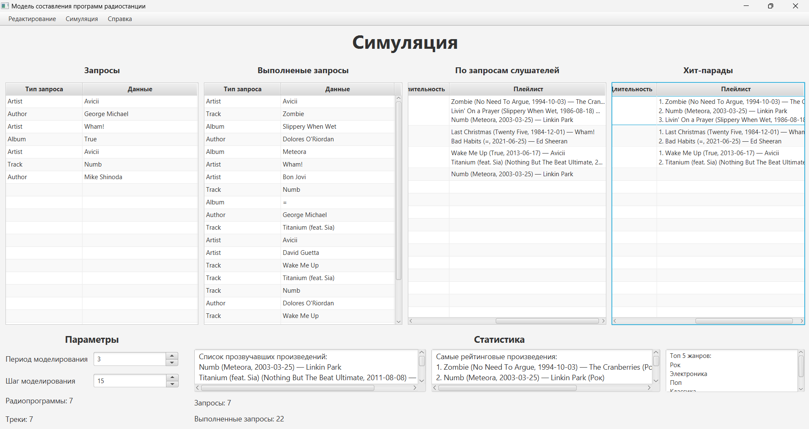
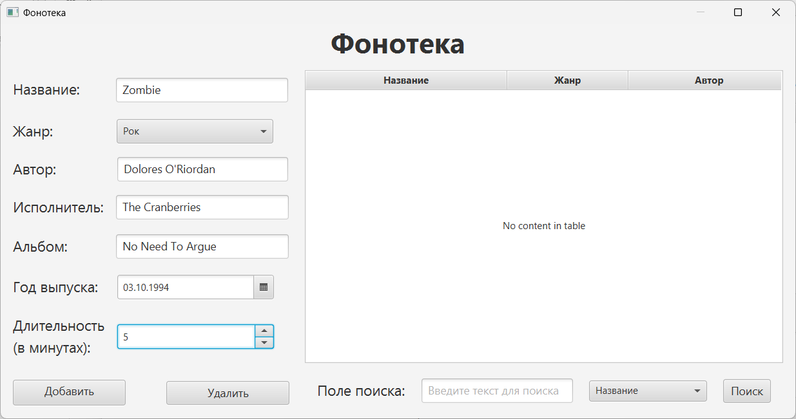
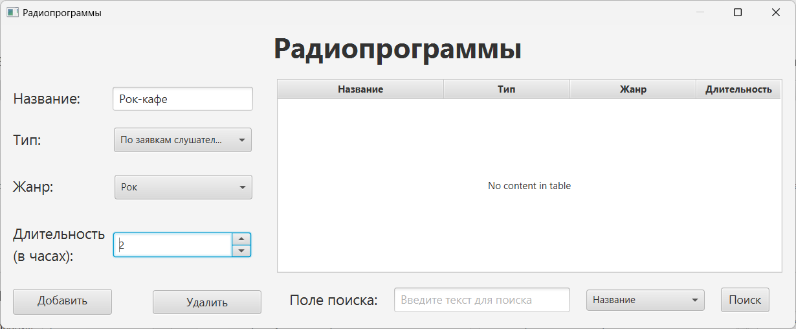
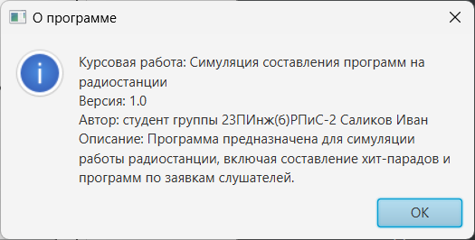
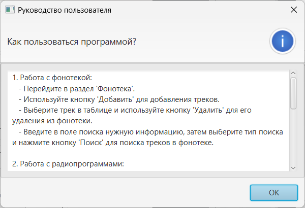

<h1 align="center">📻 Radio Station Simulation</h1>

<p align="center">
  
  
  
  
</p>

<p align="center">
  <strong>Симуляция составления программ на радиостанции на основе заявок слушателей.</strong><br>
  Разработан в рамках курсовой работы по дисциплине «Объектно-ориентированное программирование».
</p>

---

## 📖 О проекте

Приложение моделирует работу радиостанции: формирование плейлистов двух типов — **по заявкам слушателей** и **хит-парады по жанрам**. Система обрабатывает входящие запросы, контролирует разнообразие эфира и ведёт статистику популярности треков.

### Технический стек:
- **Язык:** Java 22
- **GUI:** JavaFX 22 + FXML
- **Библиотеки:** ControlsFX, BootstrapFX, Ikonli
- **Сборка:** Maven

---

## 🔑 Ключевые особенности

### 🎵 Работа с фонотекой
- Добавление/удаление треков с параметрами: жанр, автор, исполнитель, альбом, длительность, рейтинг
- Поиск по названию, автору, альбому или исполнителю
- Случайная генерация треков для тестирования

### 📻 Типы радиопрограмм
| Тип | Описание |
|-----|----------|
| **По заявкам** (`AccordingToListenersRequests`) | Формируется динамически на основе очереди запросов, с контролем повторения исполнителей |
| **Хит-парад** (`HitParade`) | Автоматически собирает топ-треки жанра по рейтингу популярности |

### 🔄 Симуляция
- Настраиваемая длительность (1–7 дней) и шаг моделирования (10–30 минут)
- Случайная генерация заявок от «слушателей»
- Статистика в реальном времени: выполненные запросы, проигранные треки, топ жанров

---

## 🧱 Архитектура классов

```
RadioStation
├── MusicLibrary ──┬── MusicTrack
│                  └── Genre
├── RequestQueue ──┬── Request (абстрактный)
│                  ├── TrackRequest
│                  ├── AuthorRequest
│                  ├── AlbumRequest
│                  └── PerformerRequest
└── RadioProgram ──┬── AccordingToListenersRequests
                   └── HitParade
```

- **Наследование:** `HitParade` и `AccordingToListenersRequests` расширяют базовый `RadioProgram`
- **Полиморфизм:** Единый интерфейс обработки заявок для разных типов программ
- **Инкапсуляция:** Логика симуляции изолирована в классе `RadioStation`

---

## 🖥️ Интерфейс приложения

| Окно | Скриншот |
|------|----------|
| **Симуляция** |  |
| **Фонотека** |  |
| **Радиопрограммы** |  |
| **О программе** |  |
| **Руководство** |  |

---

## 🚀 Быстрый старт

### Требования
- Java 22 или выше
- IntelliJ IDEA (рекомендуется) или другой Java-совместимый IDE
- Maven 3.9+

### Запуск через Maven
```bash
# 1. Клонирование репозитория
git clone https://github.com/Ivan-Salikov/RadioStationSimulation.git
cd RadioStationSimulation

# 2. Запуск приложения
mvn clean javafx:run
```

### Запуск в IntelliJ IDEA
```bash
# 1. Открытие проекта
File → Open → выбрать папку проекта

# 2. Запуск
Откройте src/main/java/com/coursework/radiostationsimulation/Main.java
и нажмите ▶️ Run
```

### Минимальный сценарий использования
1. Добавьте ≥2 треков в **Фонотеку** (Music Library)
2. Создайте 7–12 программ в **Радиопрограммы** (оба типа)
3. В окне **Симуляция** задайте параметры и нажмите **Старт**

---

## 📁 Структура проекта

```
📦 RadioStationSimulation
├── 📂 src/main/java/com/coursework/radiostationsimulation
│   ├── 📂 models/              # Ядро: классы предметной области
│   │   ├── MusicTrack.java
│   │   ├── Genre.java
│   │   ├── MusicLibrary.java
│   │   ├── Request.java        # Абстрактный класс
│   │   ├── TrackRequest.java
│   │   ├── AuthorRequest.java
│   │   ├── AlbumRequest.java
│   │   ├── PerformerRequest.java
│   │   ├── RequestQueue.java
│   │   ├── RadioProgram.java   # Абстрактный класс
│   │   ├── AccordingToListenersRequests.java
│   │   ├── HitParade.java
│   │   └── RadioStation.java
│   ├── 📂 GUI/                 # Контроллеры JavaFX
│   │   ├── SimulationFormController.java
│   │   ├── MusicLibraryFormController.java
│   │   └── RadioProgramsFormController.java
│   ├── Main.java               # Точка входа
│   └── module-info.java        # Модуль Java
├── 📂 src/main/resources/com/coursework/radiostationsimulation
│   ├── SimulationForm.fxml
│   ├── MusicLibraryForm.fxml
│   └── RadioProgramsForm.fxml
├── 📄 pom.xml                  # Зависимости Maven
├── 📄 README.md
└── 📄 .gitignore
```

---

## 📝 Примечания

> ⚠️ **Проект создан в учебных целях.** Код демонстрирует применение принципов ООП (наследование, полиморфизм, инкапсуляция) и может быть использован как референс для изучения JavaFX и проектирования классов.

---
